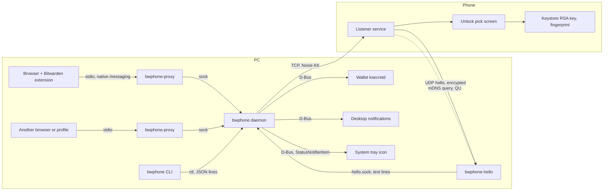
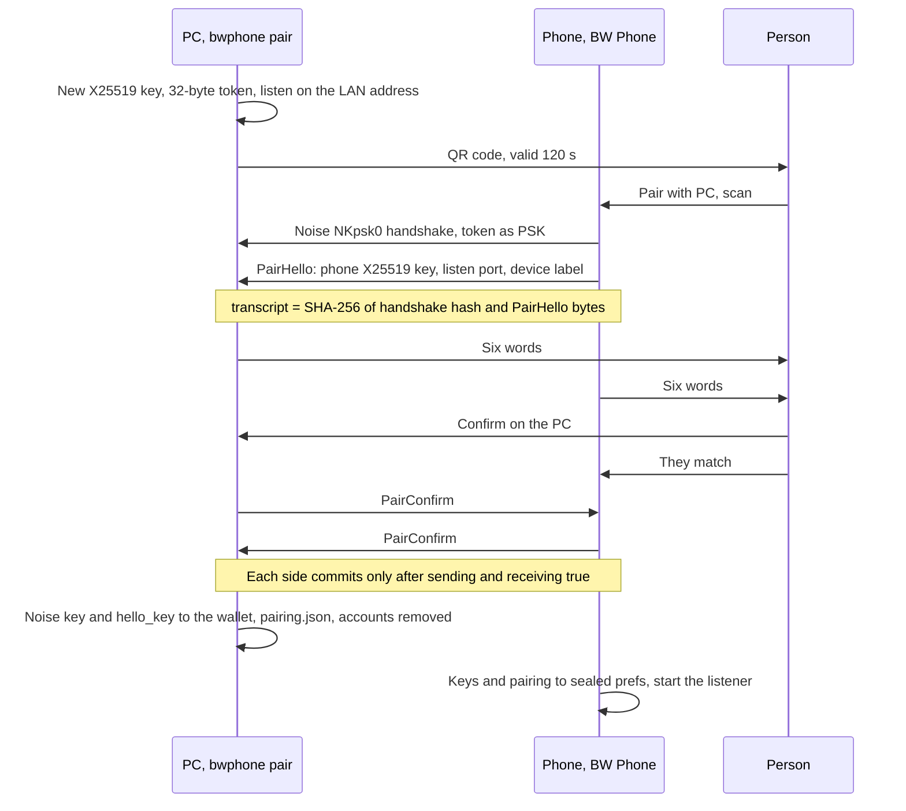
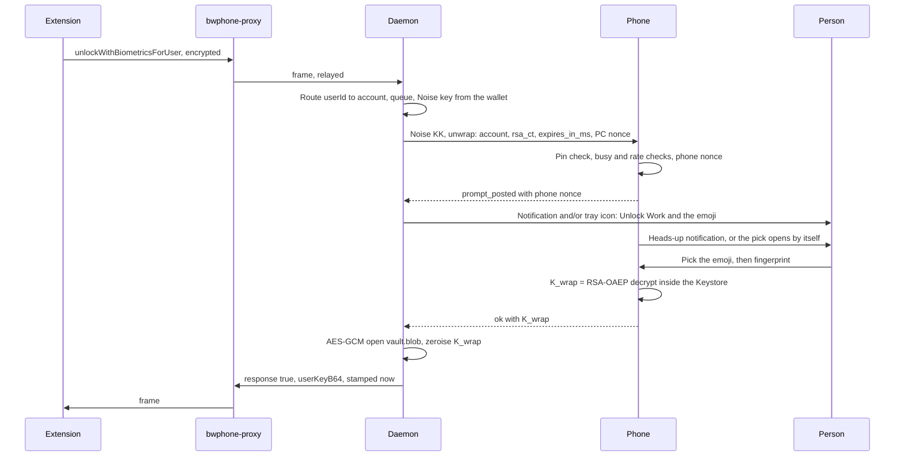
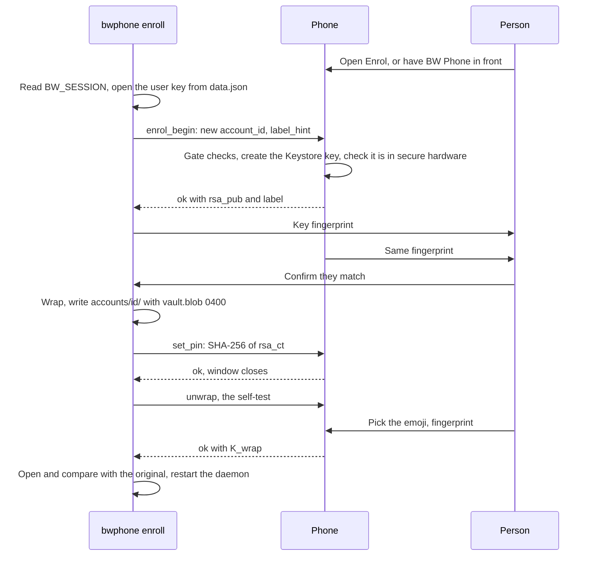
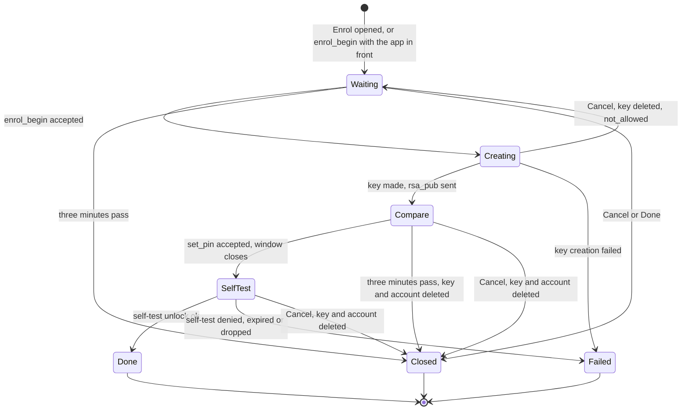

# bwphone specification

This is the specification of bwphone: what each part does, the formats and
protocols between them, and what the system does and does not defend.

## 1. Purpose and scope

bwphone replaces the Bitwarden desktop app's "unlock with biometrics" for the
browser extension on a Linux PC. The extension asks a native-messaging
host for the vault's user key; bwphone answers only after the person picks the
right emoji and touches the fingerprint sensor on their paired Android phone.

The user key is kept on the PC only as `vault.blob`: an AES-256-GCM box
whose key (`K_wrap`) is wrapped with RSA-OAEP to a per-account key that lives
in the phone's Keystore, cannot be exported, and can be used only once per
fingerprint. The phone decrypts `K_wrap`, never the vault key.

Compared with the desktop app on Linux, bwphone survives restarts (the desktop
app keeps the key in memory only, so every restart needs the master password)
and replaces the keyloggable factor (polkit, that is, the login password on
X11) with a fingerprint on another device. It does not beat memory-only
storage at rest, and it does nothing against code running as the user.

Out of scope: disk encryption, Wayland-only concerns, Flatpak/Snap browsers
(they cannot reach a host outside their sandbox), and any remote or cloud
relay. Both devices must be on the same Wi-Fi network.

## 2. Components

| Component | Where | Role |
|---|---|---|
| `bwphone daemon` | PC, systemd user unit `bwphone.service` | Holds the key material; serves the extension; talks to the phone; the only process that reads the wallet |
| `bwphone` CLI | PC, `~/.local/bin` or `/usr/bin` | `pair`, `enroll`, `account list/remove`, `unlock` (dry run), `status`, `hello-reset`, `manifests write/check` |
| `bwphone-proxy` | PC, `<prefix>/lib/bwphone/` | Spawned by each browser per extension connection; relays stdio to the daemon's socket unchanged |
| `bwphone-hello` | PC, `<prefix>/lib/bwphone/`, unit `bwphone-hello.service` | Receives the phone's encrypted address announcement; answers the rotating mDNS name. Holds only `hello_key` |
| BW Phone | Android 9 (API 28) and up, targetSdk 36 | Keystore keys, the emoji pick, BiometricPrompt, the listener, pairing and enrollment screens |



### Sockets and paths (PC)

| Path | Mode | Who connects | Protocol |
|---|---|---|---|
| `$XDG_RUNTIME_DIR/bwphone/sock` | dir 0700, socket 0600 | `bwphone-proxy` | Native-messaging frames, relayed raw |
| `$XDG_RUNTIME_DIR/bwphone/ctl` | dir 0700, socket 0600 | the CLI | One JSON line each way |
| `$XDG_RUNTIME_DIR/bwphone-hello/hello.sock` | dir 0700, socket 0600 | `bwphone-hello` | ASCII lines: `key` → `key <64 hex> <port>` / `locked` / `missing`; `hello <ip> <port> <seq>` → `ok` / `stale` / `unpaired` / `error …` |
| `$XDG_RUNTIME_DIR/bwphone/daemon.lock` | file 0600 | — | Held under `flock` by the running daemon (see [one of each per user](#one-of-each-per-user)) |
| `$XDG_RUNTIME_DIR/bwphone-hello/hello.lock` | file 0600 | — | Held under `flock` by the running `bwphone-hello` |
| `~/.config/bwphone/config.toml` | — | — | The daemon's settings, read at start (see [the PC indicator](#the-PC-indicator)) |
| `~/.local/share/bwphone/` | see [storage](#12-storage-at-rest) | — | `pairing.json`, `accounts/<account_id>/` |
| `~/.local/state/bwphone/log` | — | — | The daemon's log |

Permissions are set explicitly, not left to the umask, and every connection is
checked with `SO_PEERCRED`: a peer whose uid is not ours is dropped before a
byte is read. That is the only local authentication; the protocols carry
none.

### Process hygiene

- Every `bwphone` subcommand, not only the daemon, sets `PR_SET_DUMPABLE=0`
  and `RLIMIT_CORE=0` before loading a secret (`pair` holds the Noise key,
  `enroll` holds the plaintext user key).
- The daemon never writes to stdout. `bwphone-proxy`, whose stdout is the
  message pipe, duplicates fd 1 for the relay and points fd 1 at `/dev/null`.
- Types holding the user key, `K_wrap`, the Noise key or `hello_key` are
  zeroised on drop.
- `bwphone.service`: `LimitCORE=0`, `ProtectSystem=strict`,
  `ProtectHome=read-only` with the data, state and runtime directories
  writable, `PrivateTmp`, `NoNewPrivileges`, `MemoryDenyWriteExecute`, kernel
  and control-group protections, `RestrictAddressFamilies=AF_UNIX AF_INET
  AF_INET6`. It keeps the session bus (wallet, notifications).
- `bwphone-hello.service` gets less: no session bus, `ProtectHome=tmpfs` with
  only its own runtime directory bound back, `CapabilityBoundingSet=` empty,
  `SystemCallFilter=@system-service`, `PrivateDevices`, `ProtectProc=invisible`.
  Compromised, it can tell the daemon a wrong phone address and nothing more.

### One of each per user

At most one daemon and one `bwphone-hello` run per user. Each takes an
exclusive, non-blocking `flock` on its lock file before anything else: the
daemon before it binds a socket, reads the wallet or sends a notification;
`bwphone-hello` before it asks for `hello_key`. A second copy that finds the
lock held prints why on stderr and exits with status 3, and both units set
`RestartPreventExitStatus=3`, so systemd does not retry it every 2 s. The
running copy is not touched.

Without the lock, a second daemon would unlink the first's sockets and bind
its own, leaving the first running, unreachable, with the key in memory, and
both writing `pairing.json`. The lock is also what makes that unlink safe: a
socket file the lock holder finds can only be left over from a dead daemon.

- **No stale locks.** The kernel drops a `flock` when its holder exits,
  `SIGKILL` and `panic = "abort"` included, so there is no PID file to clean
  up.
- **Through the sandboxes.** `flock` locks the file, not the path. The units'
  views of `$XDG_RUNTIME_DIR` are bind mounts of the real directories, so a
  copy inside a unit and one started by hand compete for the same lock.
  `RuntimeDirectoryPreserve=yes` keeps the directories across restarts, so a
  running `bwphone-hello` never holds a lock in a deleted copy.
- **Per user, not per machine.** The lock files live in `$XDG_RUNTIME_DIR`.
  The hello UDP port is still shared by every user on the machine; a second
  user needs another `--hello-port` at pairing.

## 3. Native messaging interface

What the extension speaks, verified against `bitwarden/clients` at
`browser-v2026.9.0`.

**Manifests.** `com.8bit.bitwarden.json` in each installed browser's
`NativeMessagingHosts/` directory (Chrome, Chromium, Brave, Edge, Vivaldi:
`~/.config/{google-chrome,chromium,BraveSoftware/Brave-Browser,
microsoft-edge,vivaldi}/`) and `~/.mozilla/native-messaging-hosts/`
(Firefox), with `"type": "stdio"` and `path` pointing at `bwphone-proxy`, for
each browser whose config directory exists. Chromium-family manifests list the
same `allowed_origins` as Bitwarden's desktop app:
`nngceckbapebfimnlniiiahkandclblb` (Chrome Web Store, also used by Chromium,
Brave and Vivaldi), `hccnnhgbibccigepcmlgppchkpfdophk` (its beta channel),
`jbkfoedolllekgbhcbcoahefnbanhhlh` (Edge Add-ons) and
`ccnckbpmaceehanjmeomladnmlffdjgn` (Opera add-ons), each as
`chrome-extension://<id>/`; Firefox lists `allowed_extensions`
`{446900e4-71c2-419f-a6a7-df9c091e268b}`. Installing the
real desktop app overwrites them; the daemon checks them at start and raises a
desktop warning if one no longer points at the proxy.

**Framing.** A 4-byte length in the host's native byte order, then that many
bytes of UTF-8 JSON (at most 1 MiB).

**Handshake.** The host sends `{"command":"connected"}` first. The extension
sends a plaintext `setupEncryption` with an RSA-2048 public key (SPKI, base64).
The host makes a fresh 64-byte session key (bytes 0–31 AES-256, 32–63
HMAC-SHA256), encrypts it with RSA-OAEP-SHA1 (SHA-1 is pinned by the
extension, for the label hash and MGF1) and replies
`{"appId", "command":"setupEncryption", "messageId":-1, "sharedSecret"}`. The
`-1` is part of the contract.

**EncString type 2** on every later message, always as an object:

```text
iv  = 16 random bytes
ct  = AES-256-CBC(key[0..32], iv, PKCS#7(plaintext))
mac = HMAC-SHA256(key[32..64], iv || ct)
{"encryptedString": "2.<iv>|<ct>|<mac>", "encryptionType": 2, "iv", "data", "mac"}
```

The MAC is checked first, in constant time. An encrypted message that
fails it gets `{"command":"invalidateEncryption", "appId"}` with the channel's
`appId`; the extension then drops the pipe, wipes its key and handshakes
again. Encrypted traffic with no channel yet is not answered, and traffic
from another `appId` drops the channel with an `invalidateEncryption` for the
channel's own `appId`. The extension never sends either: it wipes its key
whenever the pipe closes and runs `setupEncryption` before its first
encrypted message on a new one, and its `appId` is fixed per install while
each browser has its own pipe. (The field exists because Bitwarden's
desktop app serves several browsers on one channel; the extension ignores an
`invalidateEncryption` for another `appId`.)

**Commands and replies.** An encrypted request carries `command`,
`messageId`, `userId` and `timestamp`. A request whose timestamp is more than
10 s from our clock is ignored.

| Command | Reply |
|---|---|
| `getBiometricsStatus` | `0` (Available) if the first account the daemon loaded can plausibly be unlocked now, else `2` (HardwareUnavailable); `8` (NotEnabledInConnectedDesktopApp) with no account. "First" is directory order, which is arbitrary; it changes the answer only when one account is invalidated and another is not |
| `getBiometricsStatusForUser` | The same, for that `userId` |
| `unlockWithBiometricsForUser` | `{"response": true, "userKeyB64": …}`, or `{"response": false}` at once for an unenrolled `userId` and for every failure |
| `authenticateWithBiometrics` | `false` |
| `canEnableBiometricUnlock` | `true` for an enrolled `userId` |
| anything else | `false` |

The extension asks `getBiometricsStatus` (no `userId`) only for two
things: whether its "Unlock with biometrics" setting may be switched on
(refused on `2` and `8`), and whether its "verify your identity" dialogs
offer biometrics (only on `0`; that choice then fails, since
`authenticateWithBiometrics` is `false`). Its lock screen asks
`getBiometricsStatusForUser`.

`authenticateWithBiometrics` is what the extension uses for its "verify your
identity" dialogs, and what passkey user verification will use once the
extension turns it on (in `browser-v2026.9.0` an unlocked vault counts as
verified for a passkey, unless the item asks for a master-password
re-prompt). Answering `true` without a phone round-trip would turn every one
of them into a no-op, so it answers `false` and the extension falls back to
the PIN or the master password. A real verify request to the phone is future
work.

"Plausibly" means: the account is enrolled and not invalidated, the wallet
gives the Noise key, the phone's address is known, and the last reach did not
fail. After a failed reach, the next status query more than 30 s later sends
one `ping`, so availability recovers without polling.

**Timestamps.** A reply's inner `timestamp` is stamped when it is sealed, not
when the request arrived, so a 40 s wait on the phone never produces a reply
the extension drops as stale. The extension abandons a request after 60 s.

**The SDK IPC channel.** The extension also opens a second port to the
same host, for Bitwarden's SDK IPC (`bitwarden-ipc`: a JSON envelope
`{"type":"bitwarden-ipc-message", …}` around CBOR frames of an
unauthenticated Noise NN channel). bwphone does not speak it: those frames
fail to parse as native messaging, are logged and dropped, and the
extension's discover request on that port times out. With the server-side
`biometrics-sdk-ipc` flag on, the extension asks for status, unlock and
verification over that channel only, so bwphone can no longer serve it (see
[Known limits](#15-known-limits)).

**Concurrency.** Requests on one pipe are handled concurrently (the extension
keeps polling status while an unlock waits on the phone); replies go out
through one writer, in completion order.

## 4. Transport

### Channels

| Use | Pattern | Prologue |
|---|---|---|
| Every PC-to-phone session after pairing | `Noise_KK_25519_ChaChaPoly_SHA256`; the PC initiates | `"bwphone/v3/kk/" ‖ pairing_id` |
| Pairing, once | `Noise_NKpsk0_25519_ChaChaPoly_SHA256`; the phone initiates; the QR token is the PSK | `"bwphone/v3/pair"` |

Both handshake messages carry empty payloads; a handshake message with a
payload is refused. The request is the first transport message, so it is
forward-secret and cannot be replayed into another session. The prologue
binds the protocol and the pairing, so a one-byte disagreement fails the
handshake. One implementation (`snow`, in `bwphone-transport`) runs on both
ends; the phone reaches it through uniffi.

**Framing.** Each Noise message is prefixed with a 2-byte big-endian length
(at most 65535 bytes).

### Messages

JSON inside the channel; binary fields are standard base64 with padding.
Every message carries `"v": 3`, and one with another version is refused. One
session carries one request.

| Request (`type`) | Fields | Reply |
|---|---|---|
| `ping` | — | `pong`; the phone shows nothing |
| `unwrap` | `account` (16 bytes), `rsa_ct` (256 bytes), `expires_in_ms`, `nonce` (32 bytes), `context.host` | `prompt_posted` with the phone's `nonce`, then a final status (with `k_wrap` on `ok`) |
| `enrol_begin` | `account`, `label_hint` | `ok` with `rsa_pub` (SPKI DER) and `label`, or a refusal |
| `set_pin` | `account`, `pin` (32 bytes) | `ok` or a refusal |

`req_id` is 16 random bytes; the PC drops a reply to another `req_id`. No
security claim rests on it.

| Status | Meaning |
|---|---|
| `prompt_posted` | Interim: the pick is on the phone. Ends the reach phase |
| `ok` | Done; carries `k_wrap` for an unwrap, `rsa_pub` and `label` for `enrol_begin` |
| `pong` | Reachability check answered |
| `denied` | Wrong emoji, dismissed, fingerprint cancelled or locked out, or the pick screen was left |
| `rejected` | The person tapped None of these |
| `pin_mismatch` | `rsa_ct` is not the account's pinned ciphertext; no prompt was shown |
| `rate_limited` | Over the phone's hourly cap |
| `busy` | Another request is already on the phone |
| `expired` | The human phase ran out; no `K_wrap` is ever sent |
| `invalidated` | The account's Keystore key is gone or unusable |
| `unknown_account` | The phone has no such account |
| `not_allowed` | Refused by policy (enrollment gate, second `set_pin`) |
| `label_taken` | `enrol_begin` for a name the phone already has |
| `error` | Anything else |

### Budgets

The extension gives up after 60 s, so an unlock spends that minute in phases:

| Phase | Budget | Notes |
|---|---|---|
| Connect | 3 s | Bounded separately, so a black-holed SYN cannot eat the reach budget |
| Reach | 5 s | From the first Noise payload to `prompt_posted`. The kernel completes a TCP handshake into the backlog even when the app is asleep, so `connect()` proves nothing |
| Human | up to 45 s | Sent as `expires_in_ms`, relative, so the clocks never need to agree. The phone clamps it to 1–60 s |
| Headroom | 10 s | The GCM open, the reply and scheduling jitter |

5 + 45 + 10 is the extension's 60 s exactly; a longer human phase would
produce answers the extension has already abandoned. Pocket to fingerprint
takes 10–30 s in practice, which is why the human phase is long and the
reach phase short.

Every failure before the pick is on the phone returns `false` within the
reach budget; the only long wait is the one where it already is.

**Queueing.** The daemon has one phone session at a time. Requests queue in
arrival order; one that would get less than 15 s of human phase is refused at
once. When an unlock succeeds, queued requests for the same account share the
answer (two browsers on one account need one fingerprint), if their own
deadline still allows. A request whose browser has closed its pipe is
dropped: skipped if it is still queued, and if its prompt is up, the
session is closed (which takes the prompt down on the phone) unless another
request for the same account is queued behind it.

## 5. Pairing

Once per PC–phone pair. `bwphone pair` refuses while a pairing exists
unless given `--replace`.



**QR payload.** `version(1)=3 ‖ PC X25519 public key(32) ‖ token(32) ‖
IPv4(4) ‖ pair port(2) ‖ hello port(2)`, 73 bytes, base64url without padding.
The QR is a bearer credential while it is on screen, and any X11 client can
capture the screen; pairing is short-lived for that reason, and an unexpected
failure should be restarted, not retried.

**Derived values**, all from `transcript = SHA-256(NKpsk0 handshake hash ‖
PairHello bytes)` with HKDF-SHA256 (no salt):

| Value | Info string | Length |
|---|---|---|
| Six words | `bwphone/v3/sas` | 9 bytes; the top 66 bits index the BIP-39 English list, 11 bits a word |
| `hello_key` | `bwphone/v3/hello` | 32 bytes |
| `pairing_id` | `bwphone/v3/pairing-id` | 16 bytes |

Folding the PairHello into the transcript means the words also cover the
phone's X25519 key. A relay cannot complete the handshake without the token.

**Timeouts.** The phone must connect within 120 s of the QR appearing, finish
the handshake and send its PairHello within 10 s, and the PC waits up to
180 s for the phone's confirmation.

**What is stored.** PC: the Noise private key and `hello_key` go straight
into the wallet (they never touch a file); `pairing.json` records the phone's
public key, `pairing_id`, device label, date, listen port, hello port, last
address, the port the last hello announced, and last hello `seq`. Because every existing blob was wrapped to keys
the old phone held, `pair` deletes `accounts/`: nothing is served until a
fresh enrollment has round-tripped. Phone: its X25519 private key, the
PC's public key, `pairing_id`, `hello_key`, the PC's address and the
hello port, in sealed preferences.

Exactly one pairing. A second one needs Revoke all on the phone and `pair
--replace` on the PC.

## 6. Emoji matching

Every unlock shows one emoji on the PC, and the phone asks the person to
pick it from five, or tap None of these, before it asks for a fingerprint.

**Derivation.** Neither side picks it:

```text
okm   = HKDF-SHA256(salt = none, ikm = h ‖ pc_nonce ‖ phone_nonce, info = "bwphone/v3/emoji", L = 32)
index = okm[0] & 0x1F
```

`h` is the KK handshake hash. `pc_nonce` (32 random bytes) travels inside
the encrypted `unwrap` request; the phone draws `phone_nonce` only after that
request has arrived and returns it in `prompt_posted`. The nonces are there
because `h` alone is a function of public data: anyone holding `pairing.json`
who sees the two handshake frames could recompute it, and so the emoji. Both
nonces sit under transport keys that need `ee`, so that observer learns
nothing, and neither side can steer the result: the phone's nonce comes after
the PC's is committed. The emoji itself is never sent.

**The list**, compiled into `bwphone-transport` so both ends index the same
32 (2⁵, so every emoji has equal odds):

| Food | 🍎 🍌 🍇 🍉 🍓 🍍 🥑 🥕 🌽 🥦 🧀 🍕 🍔 🍩 🍪 🍦 |
|---|---|
| Faces | 😀 😂 😍 😎 😇 🙃 🤓 😡 😱 😴 🤔 🤢 🤡 🤠 🥶 🥳 |

Nothing is newer than Emoji 11, which Android 9 draws natively.

**The phone's five.** The real one plus four distinct decoys drawn from the
other 31 with the OS CSPRNG, shuffled. The shapes framing them are assigned by
position, never by emoji. None of these is always in the same place. A blind
tap succeeds one time in five.

**Alarms.** A `busy` answer when the daemon has nothing else at the phone
means someone else is asking; the PC warns "Another unlock request is
waiting on your phone". One false alarm is known: `bwphone enroll` runs its
self-test unwrap from its own process, not through the daemon, so a browser
unlock during that self-test gets `busy` and raises this warning although
the request on the phone is your own. A `rejected` (None of these) warns "Someone else asked
your phone to unlock". A `rate_limited` warns "Your phone refused: too many
unlock requests in the last hour", since the phone refuses it before any
prompt and shows nothing. The phone also counts sessions in the last hour that
finished the handshake and then asked for nothing (someone grinding sessions
for a chosen emoji does exactly that) and shows the count on the next pick.

## 7. Unlock



Early exits, each answered `false` at once:

- Before the pick: unknown or unenrolled `userId`, retired or invalidated
  account, no known address, wallet locked, no answer within the reach budget,
  `pin_mismatch`, `busy`, `rate_limited`, `invalidated`, or too little time
  left in the queue.
- During the human phase: the person picks a wrong emoji, taps None of these,
  dismisses or fails the fingerprint, leaves the pick screen, or presses Use
  password on the PC's notification; the deadline passes (the phone
  cancels the prompt and never sends `K_wrap`; a late one is discarded and
  zeroised on the PC).
- After: the blob fails to open under the returned `K_wrap` (the PC warns
  that it may have been altered).

`bwphone unlock --label <name>` runs the same path from the CLI and prints the
user key's SHA-256, never the key.

### The PC indicator

Once the phone has posted its prompt, the PC shows the request's emoji in
one or both of two places, as `~/.config/bwphone/config.toml` says:

```toml
[indicator]
notification = true   # default
tray = true           # default
tray_idle = "shown"   # default; or "hidden"
```

- **Notification**: critical urgency, summary `Unlock <label> · <emoji>`,
  body "Pick this emoji on your phone, then your fingerprint.", and a **Use
  password** action that ends the request at once. Closed when the request
  ends.
- **Tray icon**: a StatusNotifierItem (`org.kde.StatusNotifierItem-<pid>-1`
  at `/StatusNotifierItem`, registered with `org.kde.StatusNotifierWatcher`,
  and again whenever the watcher restarts). Between requests it shows a keyhole
  icon with the tooltip "No unlock in progress", and is `Active` (panels show
  it) with `tray_idle = "shown"`, or `Passive` (panels keep it in their
  overflow) with `"hidden"`. During a request it is `NeedsAttention`, its icon is
  the emoji (a 64 × 64 bitmap of the pick's 32, rendered from Noto Color
  Emoji and compiled in), its title `Unlock <label> · <emoji>`, and its
  tooltip "Unlock <label>" / "Pick <emoji> on your phone, then your
  fingerprint." It has no menu and no actions: clicking it does nothing, so
  it cannot answer or cancel a request.

The file is read once at daemon start. Unknown keys and wrong types make the
whole file invalid; the daemon then logs why and uses the defaults, rather
than failing. Warnings (someone else asked the phone, a manifest was
overwritten, a retired account) are always notifications, whatever the
settings. With `notification = false` there is no Use password action on the
PC; the extension's own password field still works.

## 8. Enrollment

One Bitwarden account at a time, over an existing pairing. The plaintext user
key is destroyed only after a full unwrap through the phone has come back
equal: an OAEP parameter mismatch produces a blob that looks perfect and
never opens.

### Getting the user key

The Bitwarden CLI does the login. `bw unlock --raw` prints `BW_SESSION`, a
fresh random 64-byte AES-256-CBC + HMAC key (not derived from the password);
with it the CLI keeps the unlocked user key in `data.json` under
`__PROTECTED__<userId>_user_auto` as an EncArrayBuffer
(`type ‖ iv ‖ mac ‖ ct`). `bwphone enroll` reads the session key and opens
that entry (MAC first, constant time). Sources:

- `--from-stdin`: `bw unlock --raw | bwphone enroll --label Work --from-stdin`.
  The key never enters an environment variable, the shell history or another
  process's command line. This is the intended way.
- `--from-arg <BW_SESSION>`: works, but an argument is visible in
  `/proc/<pid>/cmdline` while enroll runs.
- `--test-user-key <base64>` with `--test-user-id`: testing only; enrols a
  given 64-byte key instead of a vault key.

The CLI's directory (`BITWARDENCLI_APPDATA_DIR`, or `--appdata-dir`) should be
on `/dev/shm`, so the unlocked `data.json` never reaches the disk.
Afterwards: `bw logout`, delete that directory, and check the wallet for items
the CLI may have left.



If any step fails, `enroll` removes the account directory it wrote. The key
fingerprint shown on both screens is the first 10 bytes of SHA-256 of the
SPKI, as five groups of four hex digits.

### The enrol window

The phone accepts `enrol_begin` and `set_pin` only inside a three-minute
window. Opening the Enrol screen opens it; so does an `enrol_begin` that
arrives while a BW Phone screen is in front, which then brings up the Enrol
screen. Back and the close button leave the screen with the window running.

`enrol_begin` is refused (`not_allowed`) when:

- the keyguard is showing, even with the unlock pick drawn over it;
- an unlock request is waiting on the phone;
- the app is in the background and no window is open;
- a key from this window is already waiting for its pin, or the account id
  already exists.

It is refused with `label_taken` for a name the phone already has, compared
case-insensitively, so a second account cannot pose as the first in the
prompt. That check comes after the window's: outside an open window every
refusal is `not_allowed`, so the PC's key alone cannot learn which names the
phone holds. `bwphone enroll` reports that by name, and the plain `not_allowed` as
"unlock the phone and open BW Phone". The unlock pick never gives way to the
Enrol screen.

The account's name is the PC's `--label` (trimmed, at most 32
characters), shown on the phone and final: the phone must answer within the
5 s reach budget, so there is no time to ask.



**The pin is write-once.** `set_pin` is accepted only inside the window, only
for the account this window created, and only if that account has no pin.
Once set, nothing the PC sends changes it; replacing it means revoking the
account (which destroys its key) and enrolling again. The pin is what stops
the phone from decrypting any ciphertext other than the one enrolled: an
`unwrap` whose `SHA-256(rsa_ct)` differs is refused before any prompt.

**Cancel** closes the window and deletes whatever it created on the phone: a
key made but not pinned, or pinned and awaiting the self-test. The PC's
next message is then refused, and `enroll` removes its own directory. A key
still being made when Cancel is pressed is deleted as soon as it exists, and
`enrol_begin` is answered `not_allowed`. A window that runs out with a key
still waiting for its pin is undone the same way: nothing can pin that key
any more.

## 9. The vault blob

One per account, written once at enrollment and never rewritten.

| Offset | Size | Field |
|---|---|---|
| 0 | 1 | version = `0x04` |
| 1 | 256 | RSA-2048 OAEP ciphertext of `K_wrap` (SHA-256 label hash, MGF1-SHA1, empty label) |
| 257 | 12 | AES-GCM nonce |
| 269 | 80 | AES-256-GCM ciphertext and tag over the 64-byte user key |

349 bytes. The AAD is bytes 0–256 (`version ‖ rsa_ct`), so a substituted RSA
ciphertext paired with the real AES ciphertext fails the tag.

**Wrap**, at enrollment only: `K_wrap` = 32 bytes from the OS CSPRNG (used as
an AES key directly; no KDF, since it is uniform); `rsa_ct` = OAEP-encrypt to
the account's phone key; a random 12-byte nonce; seal the user key; write to
a temporary file created exclusively with mode 0600, `fsync`, set 0400, hard-
link into place (so an existing blob is never overwritten), `fsync` the
directory; then `set_pin`, then the self-test, then zeroise `K_wrap`.

**Unwrap**: parse and refuse any version but `0x04` before any network or
prompt; send `rsa_ct`; open with the returned `K_wrap`; a tag mismatch aborts
loudly; zeroise `K_wrap` and the user key after the reply. Nothing is written.

**Versions.** Only `0x04` is accepted; `0x01`, `0x02` and `0x03` are retired
and refused before anything else, so none of them can become a live parsing
path. An account left with a retired blob is listed by `bwphone account
list` as retired, never served (its `userId` gets `false` at once), and named
in a desktop notification when the daemon starts; it does not stop the
daemon.

Why MGF1 is SHA-1: Android Keystore before Android 14 rejects every MGF1
digest but SHA-1 for OAEP. MGF1 relies on no collision resistance, so SHA-1
there costs nothing, and it is also Keystore's default. The label hash stays
SHA-256.

## 10. The phone

### The account key

One RSA-2048 key per account, alias `bwphone-unwrap-v1-<account_id hex>`,
`PURPOSE_DECRYPT`, created on the Enrol screen:

| Setting | Value |
|---|---|
| Digests | SHA-256 and SHA-1 (SHA-1 because it is the MGF1 digest; some KeyMint versions check MGF1 against the declared set) |
| Padding | OAEP |
| User authentication | required |
| Android 11 and later | `setUserAuthenticationParameters(0, AUTH_BIOMETRIC_STRONG)`: every use, strong biometric only |
| Android 9 and 10 | `setUserAuthenticationValidityDurationSeconds(-1)`: every use through a CryptoObject, which only a biometric can authorise |
| New biometric enrolled | key invalidated (`setInvalidatedByBiometricEnrollment(true)`) |
| StrongBox | requested; falls back to the TEE if unavailable (`StrongBoxUnavailableException` or `ProviderException`) |
| Secure hardware | checked after generation (`KeyInfo` security level on API 31+, `isInsideSecureHardware` below); a key outside it is deleted and enrollment refused |

Decrypt: `Cipher.getInstance("RSA/ECB/OAEPPadding")` initialised with
`OAEPParameterSpec("SHA-256", "MGF1", MGF1ParameterSpec.SHA1,
PSource.PSpecified.DEFAULT)`, wrapped in `BiometricPrompt.CryptoObject`. The
prompt allows `BIOMETRIC_STRONG` only, never the device credential: the phone
PIN must never unwrap the vault. Five failed reads lock the sensor for 30 s,
then until the phone is unlocked with its PIN; the PIN lifts the lockout but
does not unlock the key. The fallback is the master password on the PC.

**Invalidation.** A new fingerprint throws
`KeyPermanentlyInvalidatedException` at `cipher.init`; removing the screen
lock deletes the key. The listener probes every account's key when it starts;
an unusable one (either case, or Keystore refusing the parameters) is marked
invalidated, answered `invalidated` without a prompt, and shown on Home as
"enrol again".

### What the phone enforces

In order, for an `unwrap`:

1. **Pre-authentication deadline.** The handshake and the request must arrive
   within 5 s of `accept`, however slowly the bytes trickle.
2. **Account and pin.** Unknown account: `unknown_account`. Pin mismatch:
   `pin_mismatch`, without a prompt.
3. **Invalidation**: `invalidated`, without a prompt.
4. **One request in flight**: a second is answered `busy` at once.
5. **Rate limit**: prompts per hour, 20 per account and 30 overall by
   default; over it, `rate_limited`. Both are set on the phone's Settings
   screen (per account 1–50, overall from the per-account value up to 100),
   never by the PC; Revoke all resets them. Only prompts count: a refused request is not recorded,
   so the window drains an hour after the last prompt however often someone
   keeps asking. At 3 or more in the last minute the prompt says requests
   are arriving faster than usual.
6. **Deadline**: `expires_in_ms`, clamped to 1–60 s; when it passes the prompt
   is cancelled and `K_wrap` is never sent.

The listener binds only to the current Wi-Fi network's IPv4 address (never
mobile data or a VPN), rebinds on network changes, and holds no socket while
off Wi-Fi. It accepts at most 8 sessions at once and 10 connections per
source address per minute; anything beyond is closed at `accept`.

**Nothing visible before a valid request.** No notification, sound, vibration
or screen wake until the handshake has completed, the request has decrypted
and its `rsa_ct` matches the pin. A connection that fails any of those is
closed silently. This is what makes listening on any Wi-Fi network safe:
anyone can reach the port, but only the paired PC can make the phone do
anything you would notice. The pre-authentication deadline, the session cap
and the per-source cap keep strangers from parking sessions, keeping a
battery-exempt phone awake, or using up the PC's share.

**Nothing from the request on screen.** The request is caller-supplied, and
the pick screen is where the person decides; so the label, the unlock count
and the last unlock time it shows are the phone's own, and `context.host` is
only logged.

### Delivery of the prompt

A foreground service cannot start an activity from the background, so the
service posts a high-importance heads-up notification (no full-screen
takeover, so no extra permission) ("Unlock request for Work") on
the *Unlock requests* channel; tapping it opens the pick over the lock screen
(`showWhenLocked`, `turnScreenOn`). While any BW Phone screen is in front, the
pick opens by itself and the notification is posted silently, as the way
back; opening the app while a request waits also opens the pick. The
listener's persistent notification is on its own minimum-importance
*Listener* channel and can be switched off without touching unlock requests.
Leaving the pick screen without answering is a denial. A short partial wake
lock is held only around the prompt and reply.

### Lifecycle

The listener restarts on `BOOT_COMPLETED` and `MY_PACKAGE_REPLACED`. Keystore
keys that need authentication are unavailable until the first unlock after a
reboot (Direct Boot), so nothing works before it. The battery optimisation
exemption is optional: with it the phone answers from a pocket; without it,
Doze cuts the network while the screen has been off a while, and the phone
must be woken (a screen unlock is enough) before unlocking the vault. It is
also one of the exemptions that let the service start from the background on
Android 12 and later, as are the boot and package-replaced broadcasts.
`allowBackup="false"` and data-extraction rules exclude everything from cloud
and device-to-device backups.

## 11. Discovery

The phone announces its address; the PC never scans.

**Hello.** One UDP packet to the PC's hello port (default 8732):
`nonce(24) ‖ XChaCha20-Poly1305(hello_key, nonce, aad = "bwphone/v3/hello",
{"ip", "port", "seq"})`. No plaintext identifier, so a stranger holding the
PC's old address sees random bytes. `seq` is monotonic; the PC ignores
any hello not higher than the last one it accepted, so a replay cannot point
it at an old address. `bwphone-hello` decrypts it and hands the address to the
daemon; a packet that does not authenticate is dropped without a reply.
`bwphone hello-reset` forgets the last `seq`, for the case where a `hello_key`
holder has sent the largest possible one.

**Rotating mDNS name.** The PC answers, and never announces, a name only
the paired phone can compute:

```text
name = base32(HMAC-SHA256(hello_key, "bwphone/v3/mdns" ‖ "YYYY-MM-DD"))[0..16], lowercased, + ".local"
```

The date is UTC; the PC answers yesterday's, today's and tomorrow's names
(midnight and clock skew), with a one-record A answer, TTL 10 s, unicast when
the query has the QU bit. It answers on 224.0.0.251:5353 with
`SO_REUSEPORT`, IPv4 only. No service type, no probing. A forged answer only
swallows the hello (denial of service; Noise still gates everything).

**When the phone asks.** On joining a Wi-Fi network and on the screen being
unlocked (`ACTION_USER_PRESENT`), never on a timer: one mDNS query under a
multicast lock held for at most 2 s, then one hello to the answer, or to the
last known address if none came. The phone listens on port 8731, or on an
ephemeral port if that is taken, which the hello then announces.

If the PC joins a network after the phone, the phone asked too early; a
screen unlock sends a fresh hello.

## 12. Storage at rest

### PC

| Secret or file | Where | Protection | What it holds |
|---|---|---|---|
| Noise static private key | wallet item `service=bwphone`, `key=noise-static` | The wallet (ksecretd), unlocked by the login password | Speaking to the phone as the PC |
| `hello_key` | wallet item `service=bwphone`, `key=hello` | The wallet | Decrypting address announcements, computing the mDNS name |
| `pairing.json` | `~/.local/share/bwphone/` | Not secret | Phone's X25519 public key, `pairing_id`, device label, date, ports, last address and port, last hello `seq` |
| `vault.blob` | `accounts/<account_id>/`, 0400, directory 0700 | Inert without the phone | That account's wrapped user key |
| `phone.rsa.pub` | same directory | Not secret | The account's RSA public key, SPKI DER |
| `account.json` | same directory | Not secret | Bitwarden `userId` and label, for routing |

The daemon reads the wallet items once and keeps them in zeroised memory; if
the wallet is locked or an item is missing it reports unavailable and tries
again on the next request. It never falls back to a file. `bwphone-hello`
gets `hello_key` from the daemon over its socket and never touches the
wallet. Wallet labels and attributes are plaintext on disk and say nothing
more than the above.

Never written to durable storage: the plaintext user key, the master
password or anything derived from it, `BW_SESSION`, the CLI's `data.json`
(it belongs on `/dev/shm`), and the Noise private key anywhere but the
wallet.

### Phone

Everything below is in one SharedPreferences file whose every value is sealed
(directly with the Keystore, the approach Google recommends now that
`androidx.security:security-crypto` is deprecated) with an AES-256-GCM key in
AndroidKeyStore (alias `bwphone-prefs-v1`, no user
authentication, so the service can read it with the phone locked), with the
preference's name as the associated data, so a value moved to another name
fails to open.

| Item | Notes |
|---|---|
| Per-account RSA-2048 key | Keystore / TEE / StrongBox; non-exportable; fingerprint on every use |
| Phone's X25519 private key | Sealed prefs |
| PC's X25519 public key, `pairing_id`, `hello_key` | Sealed prefs |
| PC's last address, hello port, listen port, hello `seq` | Sealed prefs |
| Per account: label, pin (`SHA-256(rsa_ct)`), unlock count, last unlock time | Sealed prefs |
| Invalidated accounts | Sealed prefs |
| Rate-limit timestamps, unexplained-session timestamps | Sealed prefs; survive restarts |
| Unlock limits (per account, overall) | Sealed prefs; read clamped to their ranges |
| History, last 50 events | Sealed prefs; shown on Home |

The phone holds nothing Bitwarden-specific: an account is a random 16-byte id
and a label.

## 13. Accounts

One pairing serves any number of Bitwarden accounts; each has its own
Keystore key, blob, pin and label, and costs one emoji pick and one
fingerprint per unlock, so approving one account never releases another's
key.

| Item | Copies |
|---|---|
| Pairing, Noise keys, `hello_key`, mDNS name, listener | One, for the two devices |
| Keystore RSA key, `vault.blob`, write-once pin, label, counts | One per account |
| Rate limit | One overall, plus one per account |

**Routing.** The extension's request carries its `userId`; `account.json` maps
it to an `account_id`. The phone sees only the `account_id` and its own label.
An unenrolled `userId` gets `false` at once, never `wrongUserId` (which hangs
the extension for 60 s).

**Removing.** Revoke on the phone destroys that account's Keystore key and
pin: every copy of its `vault.blob` that ever existed becomes unopenable at
once, with no PC needed. `bwphone account remove <label>` deletes the
PC's directory. Revoke all on the phone destroys every key and the
pairing. A new fingerprint enrolled on the phone invalidates every account's
key; each must be enrolled again.

## 14. Threat model

The permanence rule first: the user key changes only on a deliberate
Bitwarden account key rotation. Revoking, re-pairing and re-enrolling close
the door going forward; they never retract a key already taken.

### What holds

| Attacker | Outcome |
|---|---|
| Disk or backup copy, login password not cracked | The blob is ciphertext and the Noise key is in the wallet. The Wi-Fi password is on the disk, so they can join the LAN, but cannot speak Noise as the PC |
| Disk copy with the login password cracked | From the LAN they can raise a prompt, but its emoji is on no screen of yours: None of these, then Revoke. A blind pick succeeds one time in five, and a wrong one is recorded |
| Passive LAN eavesdropper | Noise encrypts everything; the emoji depends on nonces under `ee` keys |
| Active network attacker after pairing | KK needs both static keys |
| Active attacker during pairing | The token is the PSK; a relay cannot complete the handshake, and the six words cover the phone's key |
| A stranger at the PC's old address | The hello is encrypted and carries no identifier |
| Anyone who can reach the phone's port | Without the PC's key nothing gets past the handshake, nothing visible happens, and the pre-auth deadline and caps bound what they can hold open |
| Someone watching mDNS | A random name that changes daily, answered unicast |
| Someone forging mDNS answers | The hello goes to them, encrypted and useless; the unlock falls back to the password |
| A PC-key holder targeting another account, or enrolling a look-alike | Each account needs its own pick and fingerprint; the prompt's label is the phone's own; a duplicate name is refused |
| One account's user key leaks | The others are unaffected |
| Phone stolen, locked | The unwrap needs a fingerprint; the phone PIN cannot do it |
| Someone who knows the phone PIN | They can unlock the phone but not the vault: the key takes a strong biometric only, and adding their own finger destroys it |
| Phone rooted, storage dumped | The RSA key never leaves the TEE. The phone's X25519 key allows only impersonating the phone to the PC, which fails the GCM tag. Modulo TEE bugs |
| Another local uid on the PC | `SO_PEERCRED` refuses it |
| A ciphertext we never issued | The write-once pin refuses it without a prompt |

### What does not hold

- **Disk tampering.** With no disk encryption (out of scope), anyone with the
  disk for a few minutes can replace `bwphone-proxy` or the shell config; at
  the next login you run their code, which is the next item.
- **Malware running as you.** It can raise a prompt and read the emoji off the
  screen, read the wallet items, or take the key from the daemon's reply or
  the extension's heap. Unfixable at this layer.
- **X11 keylogging of the fallback.** The master password is still typed
  whenever the phone path fails (client-isolated networks, Doze without the
  exemption, lockout, no answer). bwphone makes that rarer, not impossible.
- **A compromised phone plus your fingerprint.** The pin limits it to the
  enrolled blobs, and for those it is an unwrap.
- **Coercion.** A fingerprint can be compelled; invalidation on enrollment
  stops someone adding their finger, not yours being used.
- **Hostile code on the phone.** An overlay or accessibility app could
  interfere with the pick screen. Out of scope, as on the PC.
- **Tracking.** The phone's open port is visible on every Wi-Fi network it
  joins; two networks visited on the same day can be linked by the mDNS name.
- **An unpatched phone.** On an Android version without security updates the
  TEE, kernel and Wi-Fi stack carry public bugs; the "rooted" row weakens
  accordingly. No app code compensates.

Against the Bitwarden desktop app on Linux: memory-only at rest there,
ciphertext only here; survives restarts here, not there; the factor is a
fingerprint after an emoji pick instead of the login password, keyloggable
here only on the fallback. Neither resists same-user malware.

## 15. Known limits

- **Networks.** No shared, open network, no unlock: mobile data, a full-tunnel
  VPN, and networks with client isolation (most hotels, many cafés and guest
  networks) fall back to the master password.
- **Browsers.** Flatpak and Snap browsers cannot reach a host outside their
  sandbox.
- **Direct Boot.** After a phone reboot, nothing works until its first unlock.
- **OEM battery managers** (Xiaomi, Huawei, Samsung's sleeping apps) may stop
  the listener; opening the app starts it again.
- **StrongBox RSA** can be slow, on the order of a second per decrypt; phones
  without StrongBox use the TEE.
- **One fingerprint per account.** Three browsers on three accounts means
  three scans, by decision.
- **Protocol drift.** Bitwarden's browser-to-desktop IPC is not a stable
  interface; the implementation follows `browser-v2026.9.0` and fails loudly
  on a shape it does not know.
- **The `biometrics-sdk-ipc` flag.** When Bitwarden turns it on (from its
  servers, with no extension update), the extension moves biometrics to the
  SDK IPC channel, which bwphone does not speak. Nothing warns: the extension
  reports the desktop app as disconnected, and every unlock falls back to the
  master password.
- **The real desktop app overwrites the manifests**; the daemon warns at
  start, and `bwphone manifests write` puts them back.
- **IPv4 only** for the hello and the mDNS answer.
- **RSA, not EC.** A per-use EC key needs `CryptoObject(KeyAgreement)`,
  which exists only from Android 16; on older phones only a `Cipher` can be
  bound to one fingerprint. An EC variant (faster in StrongBox) would be a
  new blob version.
